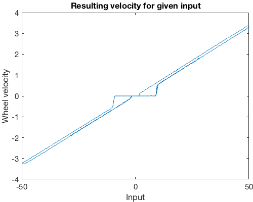

# Motor Controller

This ROS package implements a motor controller for the RAS 2017 course. The sole task of the controller node is to control the velocity of one motor.

The velocity in m/s is set by publishing a `std_msgs::Float32`-message to the `velocity_topic` set in the config.

## Motors

The response of the motors used in the course is shown below. There is a notable dead-band at low velocities.

## Velocity Output

The node publishes `geometry_msgs::TwistStamped`-messages to the `twist_topic` set in the config.